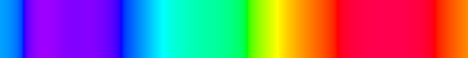
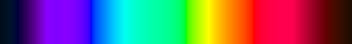

# spectral_color

> shared primitive. visible light 380–700nm mapped through CIE 1931 color-matching functions to accurate sRGB. the difference between real physics and cartoon rainbow.


## what it does

Computes `wavelengthToRGB(λ)` and `spectrumToRGB(S(λ))` using the CIE 1931 2°
standard observer. Every spectral generator in the Color Lab consumes this.

```js
import { wavelengthToRGB, spectrumToRGB, buildSpectralLUT } from "./src/js/spectral-color.js";

wavelengthToRGB(520);                       // → [r,g,b] green, 0–1
wavelengthToRGB(700, { luminance: true });  // → dim deep red (real-prism brightness)
buildSpectralLUT(256);                      // → Uint8Array, 256×1 RGBA8, WebGL-ready
spectrumToRGB([{ wavelength: 589, intensity: 1 }]); // → sodium yellow
```

## the math

**CIE 1931 CMFs** — multi-lobe (piecewise-Gaussian) analytic fit from Wyman,
Sloan & Shirley (2013). Each lobe has independent left/right σ:

```
lobe(λ; α, μ, σ⁻, σ⁺) = α · exp(−½ · ((λ−μ)/σ)²),  σ = σ⁻ if λ<μ else σ⁺

x̄ = lobe(1.056,599.8,37.9,31.0) + lobe(0.362,442.0,16.0,26.7) + lobe(−0.065,501.1,20.4,26.2)
ȳ = lobe(0.821,568.8,46.9,40.5) + lobe(0.286,530.9,16.3,31.1)
z̄ = lobe(1.217,437.0,11.8,36.0) + lobe(0.681,459.0,26.0,13.8)
```

> ⚠️ This is **not** the symmetric-Gaussian fit shipped in the original seed —
> that one leaked blue into the red end (700nm came out *purple*). See
> [`AUDIT.md`](AUDIT.md) for the diagnosis and before/after numbers.

**XYZ → linear sRGB** (D65):

```
[  3.2406  -1.5372  -0.4986 ]
[ -0.9689   1.8758   0.0415 ]
[  0.0557  -0.2040   1.0570 ]
```

**Gamma:** V ≤ 0.0031308 → 12.92·V; else → 1.055·V^(1/2.4) − 0.055

**Gamut mapping:** soft-clip — lift the most-negative channel to 0 (desaturate
toward white), then normalize. Preserves hue for the (many) spectral colors that
fall outside sRGB.

**Full spectrum:** X = Σ S(λ)·x̄(λ), Y = Σ S(λ)·ȳ(λ), Z = Σ S(λ)·z̄(λ)

## two brightness modes

| call | look | use for |
|---|---|---|
| `wavelengthToRGB(λ)` | full saturation, even brightness | LUTs, palettes, downstream generators |
| `wavelengthToRGB(λ, { luminance: true })` | bright at 555nm, dim at the ends | "spectrum on black", realistic prism |




## files

```
src/js/spectral-color.js     wavelengthToRGB, spectrumToRGB, buildSpectralLUT
src/js/naive-rainbow.js      the HSV "cartoon rainbow", for comparison
src/js/light-sources.js      sodium / mercury / hydrogen / neon / lasers / blackbody
src/shaders/spectral-color.glsl   exact GPU port (same constants, verified)
test/spectral-color.test.mjs      visual targets + z̄ regression (node --test)
tools/parity-check.mjs       asserts GLSL == JS constants
tools/png.mjs                dependency-free PNG encoder
examples/                    7 runnable snippets (see below)
docs/                        CIE reference, visual targets, naive-vs-spectral
AUDIT.md                     what was wrong in the seed and what changed
```

## examples

```sh
node examples/01-basic-wavelength.mjs    # named spectral lines, with swatches
node examples/02-build-lut.mjs           # bake + inspect the 256px LUT
node examples/03-emission-spectra.mjs    # sodium, mercury, lasers, blackbody → color
node examples/04-blackbody.mjs           # the Planckian locus, 1500K→12000K
node examples/05-naive-vs-spectral.mjs   # side-by-side in the terminal
node examples/06-export-png.mjs          # write PNGs to examples/out/
examples/07-webgl-lut.md                 # uploading + sampling the LUT in WebGL
```

## browser demo

```sh
npm run serve   # or: python3 -m http.server 8080
# open http://localhost:8080
```

`index.html` renders the spectrum-on-black, the LUT bar, the naive-vs-spectral
comparison, and emission-source swatches.

## scripts

```sh
npm test          # node --test test/
npm run parity    # JS/GLSL constant parity check
npm run check     # both of the above
```

## usage (WebGL)

```js
const lut = buildSpectralLUT(256);
gl.texImage2D(gl.TEXTURE_2D, 0, gl.RGBA, 256, 1, 0, gl.RGBA, gl.UNSIGNED_BYTE, lut);
```

Then in GLSL (`src/shaders/spectral-color.glsl`):

```glsl
vec3 c = wavelengthToRGB_LUT(u_spectralLUT, lambda);  // sample the LUT
vec3 c = wavelengthToRGB(lambda);                     // or compute analytically
```

Full walkthrough in [`examples/07-webgl-lut.md`](examples/07-webgl-lut.md).

## ecosystem

**Consumed by:** `prism_dispersion`, `rainbow_optics`, `diffraction_grating`, `opal_play_of_color`, `birefringence`
**Consumes:** none (self-contained)
**Pairs with:** any spectral generator

## references

- CIE 1931 2° Standard Observer, ISO/CIE 10527
- Wyman, C., Sloan, P.-P., Shirley, P. (2013). *"Simple Analytic Approximations to the CIE XYZ Color Matching Functions."* JCGT 2(2), 1–11. — the multi-lobe fit used here
- Wyszecki & Stiles, *Color Science* (2nd ed.), pp. 145–167
- Poynton, C. (2012). *Digital Video and HD* (2nd ed.). — sRGB transfer function
