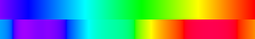

# Naive HSV rainbow vs. CIE 1931 spectral color

This is visual target #5: why "map the wavelength onto the HSV hue wheel" looks
wrong, and what the physically-based version does instead.



*Top: naive HSV. Bottom: CIE 1931 spectral (`wavelengthToRGB`).*

## The naive method

```js
hue = 270° · (1 − (λ−380)/320)   // violet→red across the hue wheel
rgb = hsv(hue, 1, 1)             // always fully saturated, full value
```

It's one line and it's everywhere (shader toys, data-viz "spectral" colormaps,
"rainbow" gradients). See `src/js/naive-rainbow.js`.

## What it gets wrong

1. **Hue is linear in wavelength — perception isn't.** HSV spreads the hue wheel
   evenly over 380–700nm. The eye doesn't: the green region (≈490–570nm) is
   perceptually huge and the cyan/yellow transitions are narrow. The naive bar
   parks a big flat green slab and rushes through the yellows.

2. **Wrong yellows and oranges.** At 580nm (a clean yellow), naive HSV is still
   in green (`#50ff00`); the spectral version is `#ffba00`. The whole 560–620nm
   band is hue-shifted green in the naive map.

3. **No luminance structure.** Every naive color is value=1. Real spectra peak in
   brightness at 555nm and fall off toward both ends (`{ luminance: true }`
   reproduces this). The naive rainbow is uniformly, flatly bright.

4. **Over-saturated.** Naive HSV is always S=1. Most monochromatic light is
   outside the sRGB gamut, so the honest representation is *less* saturated, not
   more — especially the spectral reds, which desaturate toward pink.

5. **No magenta in the violet.** True violet (≈400–430nm) leans magenta because
   `x̄(λ)` has a secondary lobe in the blue, putting real red into deep violet.
   HSV has no mechanism for this — it just runs blue→purple on the wheel.

## What the spectral method does

```
λ → (x̄, ȳ, z̄)          CIE 1931 2° color-matching functions
  → XYZ → linear sRGB    standard D65 matrix
  → soft-clip to gamut   desaturate out-of-gamut colors toward white
  → sRGB gamma           perceptual encoding
```

Every step has a physical/colorimetric justification, so the output matches what
a real prism or diffraction grating actually produces — including the parts that
"look wrong" but are correct (magenta violet, pinkish deep red, dim spectral
ends).

## Side-by-side in your terminal

```sh
node examples/05-naive-vs-spectral.mjs
```
